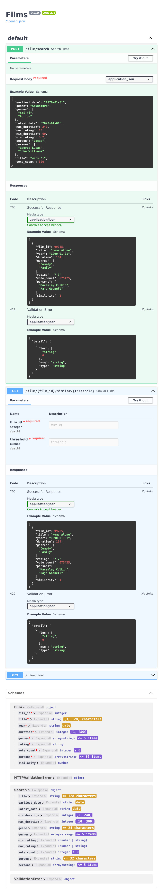

## Project outline

This repo consists of the following:

- Luigi `tasks.py` workflow management.
- A task to download _IMDb movie datasets_ from the internet.
- PySpark tasks to process the datasets and save parquet files.
- PySPark ML code to produce a similarity index of all films. ** This task can take hours and be costly to run, unless on high end hardware or a _Spark cluster_. See below.
- A task to create an embedable _DuckDB_ database file from the previous two parquet files.
- A FastAPI server to provide fast asynchronous access to the films and similarity data.
- The API server provides JSON search and similarity search functions.
- Tests for the API server.  Really "integration tests", rather than unit tests.


### Getting started: _Poetry_

Please install [_Poetry_](https://github.com/python-poetry/poetry) if you don't have it already, preferably with your system's package manager or [`pipx`](https://github.com/pypa/pipx).

A python poetry `pyproject.toml` is provided.

```bash
# install the necessary pre-requisites
$ poetry config --list

$ poetry install

$ poetry shell

# Notebooks if needed
$ poetry add Jupyter
```


Before starting any Luigi tasks or running the API server, start a shell in the newly configured environment:

```bash
# enter the python virtual env
$ poetry shell
```

###  Workflow

This project uses _Spotify_'s (_Luigi_)[https://luigi.readthedocs.io/en/stable/index.html].
The task definitions are contain in `tasks.py`. There are task defintions for all the necessary steps to produce the DuckDB database neded by the _JSON_ _API_ server.  The _FastAPI_ server is started and managed separately.

All commands should be run from the project's top-level (root) directory.
```bash
$ mkdir -p ./datasets ./output ./duckdb
```

A simple way to run all the tasks is by calling the as follows:

```bash
$ luigi --local-scheduler --module tasks AllTasks
```

The `tasks.py` modules in the dir's top-level contains the following luigi.Task and luigi.contrib.spark.PySparkTask runnable classes:
- `AllTasks ` which runs all jobs in dependcy order, which have yet to run. This task can be run as needed until the final DuckDB database file has been generated. This meta task is the only task that needs to be run.
- `SourceDataset(url, path)` downloads a dataset, it is called by `PrepFilms` if necessary. Data sets are expected to be in the `dataset/` directory and retain their `.tsv.gz` or `.csv.zip` extensions
- `PrepFilms` a PySpark job to process the source datasets into an `output/films` parquet file.
- `CosineSimilarity` a long-running and task to calculate the cosine-similarity of each film compared to every other film. See separate description.
- `CreateDuckDBFilms` task to talk `output/films/*.parquet` and create a `films` table in `./duckdb/films.duckdb` 
- `CreateDuckDBFilmsCosSim` task to talk `output/csfilms/*.parquet` and create a `films_cos_sim` table in `./duckdb/films.duckdb` database for the FastAPI.
- `GenreParquets` creates `output/genres` partitioned by genre.


Individual tasks can be started from the CLI, triggering any dependencies, using a the same pattern:

```bash
$ luigi --local-scheduler --module tasks PrepFilms
```

### Sourcing Movie datasets

Currently this project is configured to use four non-commercial     _TSV_ (tab-separated-values) tabulated files from the [_IMDb_ free corpus](https://developer.imdb.com/non-commercial-datasets/).

#### The following datasets are downloaded:
- _title.basics.tsv.gz_
- _title.principals.tsv.gz_
- _name.basics.tsv.gz_
- _title.ratings.tsv.g_


### Data transformations with PySpark

Currently there are two _Luigi_ `PySparkTask` which define an `app` external python script to perform the _Spark_ transformations:
* workflow/`task_prep_films.py`
* workflow/`task_cosine_similarity.py`

Both use DataFrames for the tabular data instead of RDDs, and should benefit from (_Catalyst_) query optimization.

The IMDb datasets are de-normalised and given new column names to form the parquet schema below.

#### The `films` parquet

The `films` DataFrame could be small enough to _broadcast()_ for any joins, while the `csfilms` could be chunked by *film_id* and iteratively broadcast.

The schema for the `films` parquet looks like this:
```
root
├── film_id: integer (nullable = true)
├── title: string (nullable = true)
├── year: date (nullable = true)
├── duration: integer (nullable = true)
├── genres: array (nullable = true)
│       ├──  element: string (containsNull = false)
├── rating: decimal(4,2) (nullable = true)
├── vote_count: integer (nullable = true)
├── persons: array (nullable = false)
│       ├── element: string (containsNull = false)
```
- `film_id` an _integer_ of the IMDb `tconst` id stripped of the leading _tt_ string.
- `genres` is a list of all the genres the film has been tagged with.
- `persons` is a list of all major _principals_ for the production, including directors, writers, producers, actors, musicians, conceivers, etc. in the order of provided in the title.principals dataset.

The resulting parquet file would have about 1.5M rows, but it this is reduced down to about 40k films only keeping film titles where:
- the title is of type `movie`
- has am IMDb rating above 6
- has over 500 votes
- has at least 1 genre specified, such as _Drama_ or _Documentary_

#### The Cosine Similarity `csfilms` parquet

In order to find similar films to any given film, it is necessary to calculate (pre-compute) a _similarity metric_ of every film compared to every other film in `films`.  The metric neads to measure similarity across a range of _features_ such that films with common cast and crew, writers, directors, genres, themes, titles and so on, have a higher corelation than others.

The feature columns used for similarity metric are 'title', 'genres', 'rating' and 'persons'.

The approach used to calculate cosine similarity index...

Spark ML functions from pyspark.ml.feature.

1. concatenate the elements of the feature columns in to one long array column
2. Compute the TF-IDF of the columnTerm Frequency-Inverse Document Frequency to produce dense vector matrices for each film_id.
3. Compute the *cross join* of the dot product or Cosine Similarity of the 40k or so films _dataframe_.  This is a length task, taking about 2 hours across 32 worker nodes.

Other similarity measures such as the _Jaccard Index_ and _Euclidean Distance_ wouldn't produce the same results. _Word2Vec_ is not necessary here.

This parquet file tends to be over 7G in size.

### The DuckDB database

Making data stored in parquet files available for rapid query via an API is challenging, particularly with the start-up time of a pyspark session.  This called for an embedded database, such as SQLite, libSQL or DuckDB.

DuckDB reads parquet files, is easy to install, and is supported by SQLAlchemy using the duckdb dialect.

The database consists of two tables:
- films
```
┌─────────────┬──────────────┬─────────┬─────────┬─────────┬─────────┐
│ column_name │ column_type  │  null   │   key   │ default │  extra  │
│   varchar   │   varchar    │ varchar │ varchar │ varchar │ varchar │
├─────────────┼──────────────┼─────────┼─────────┼─────────┼─────────┤
│ film_id     │ INTEGER      │ YES     │ NULL    │ NULL    │ NULL    │
│ title       │ VARCHAR      │ YES     │ NULL    │ NULL    │ NULL    │
│ year        │ DATE         │ YES     │ NULL    │ NULL    │ NULL    │
│ duration    │ INTEGER      │ YES     │ NULL    │ NULL    │ NULL    │
│ genres      │ VARCHAR[]    │ YES     │ NULL    │ NULL    │ NULL    │
│ rating      │ DECIMAL(4,2) │ YES     │ NULL    │ NULL    │ NULL    │
│ vote_count  │ INTEGER      │ YES     │ NULL    │ NULL    │ NULL    │
│ persons     │ VARCHAR[]    │ YES     │ NULL    │ NULL    │ NULL    │
└─────────────┴──────────────┴─────────┴─────────┴─────────┴─────────┘
```
- films_cos_sim
```
┌─────────────┬─────────────┬─────────┬─────────┬─────────┬─────────┐
│ column_name │ column_type │  null   │   key   │ default │  extra  │
│   varchar   │   varchar   │ varchar │ varchar │ varchar │ varchar │
├─────────────┼─────────────┼─────────┼─────────┼─────────┼─────────┤
│ film_id     │ INTEGER     │ YES     │ NULL    │ NULL    │ NULL    │
│ other_id    │ INTEGER     │ YES     │ NULL    │ NULL    │ NULL    │
│ similarity  │ DOUBLE      │ YES     │ NULL    │ NULL    │ NULL    │
└─────────────┴─────────────┴─────────┴─────────┴─────────┴─────────┘
```

### The FastAPI server

Start the `uvicorn` server, from the project's main root folder, optionally specifying binding --host 0.0.0.0 and --port 8000 for example:
```bash
uvicorn main:app --reload
```

FastAPI has both _Swagger-UI_ and _/redoc_.ly self service documented OpenAPI front-ends.

Browser to [localhost:8000/docs](http://127.0.0.1:8000/docs) to get started with the self servce API.

Note that _/docs_ uses an external resource [swagger-ui-bundle.js](jsdeliver.net), and pings 

The routes related to film search and similarity search are in `./api/routers/films.py`.

The API is implemented in `./api/db/films.py` along with _Pydantic_ validation. The ORM models are in `./api/db/core.py` for _DuckDB_.

_SlowAPI_ is used as a _rate limter_ to limit the number of requests per client per second or minute to an endpoint.

#### Endpoints implemented:
* POST `/film/search`
* GET `/film/{film_id}`
* GET `/film/{film_id}/similar/{threshold}`


The `/film/search` endpoint supports searching on any number of optional criteria. Additionally, the  `genre`, `person` and `title` fields provide sub-string regular expression matching, where the list of persons is `,` joined. For example, the following are valid searches:
```json
{
  "person": "J\\w+ Will",
  "persons": ["George Lucas", "Harrison Ford"]
}

```
\* note the backslash escaping `\\\w`
```json
{
  "title": "Santa(''s)?"
}
```
\* apostrophe escaping is by doubling





### Test

Currently mostly integration tests.

Once the FastAPI uvicorn server is running, check the API is working as expected by running:
```bash
pytest 
```

### directory structure:

```
.
├── api
│   ├── __init__.py
│   ├── db
│   └── routers
├── datasets
│   ├── name.basics.tsv.gz
│   ├── title.basics.tsv.gz
│   ├── title.principals.tsv.gz
│   └── title.ratings.tsv.gz
├── duckdb
│   ├── films_cos_sim.done
│   ├── films.done
│   └── films.duckdb [5.7G]
├── notebooks
│   ├── task1-1-import-imdb-datasets.ipynb
│   ├── task1-2-write-genre-parquets.ipynb
│   ├── task2-1-cosine-similarity.ipynb
│   ├── task2-2-similarity-functions.ipynb
│   ├── task2-3-export_duckdb.ipynb
│   └── task3-search-query.ipynb
├── output
│   ├── csfilms [6.5G]
│   ├── films   [11M]
│   └── genres  [9.3M]
├── tests
│   ├── __init__.py
│   ├── integration
│   │   ├── __init__.py
│   │   └── test_api.py
│   ├── unit
│   │   ├── __init__.py
│   └── test_fastapi_up.py
├── workflow
│   ├── __init__.py
│   ├── task_cosine_similarity.py
│   ├── task_create_duckdb.py
│   ├── task_fetch_datasets.py
│   ├── task_jupyter_ipynb.py
│   └── task_prep_films.py
├── luigi.cfg
├── poetry.lock
├── pyproject.toml
├── README.md
├── tasks.py
```

### Todo

- Make better use of `luigi.contrib.*` for ETL tasks like _table_ creation.
- Consider lib `runpy` in _Luigi_, or `ExternalProgramTask`. Run notebooks?
- Better logging.
- DuckDB provides `dot` product and other relevant search, index and _ML_ capabilites, such as the _VSS_ extension for Vector Similarity Search.
- Do away with PySpark entirely? 
- Use SQLAlchemy _Databricks_ dialect and dbutils as a comparison.
- Optimise the _Cosine Similarity_ task...
- Testing on a large Spark Cluster.
- Get parameter support for search functionality.
- Write more tests, particularly Unit Tests of the DB api.
- Table, columns indexes could improve search speed if the number of titles in _films_ grows much larger.
- The films should have their _original title_, besides the English translation.
- The original _language_ should be sourced, as well as other attributes.
- Finally a React/Native front-end could be added.
- Search results paging.